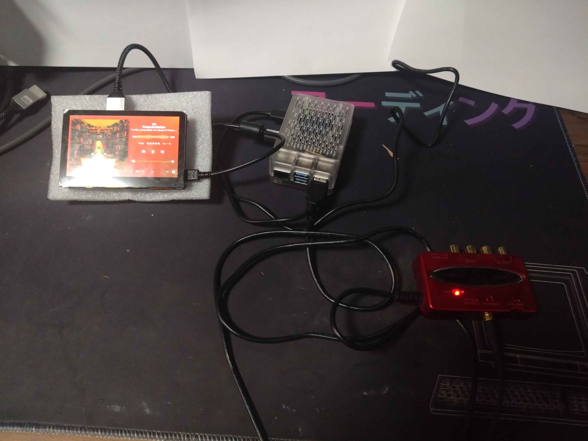
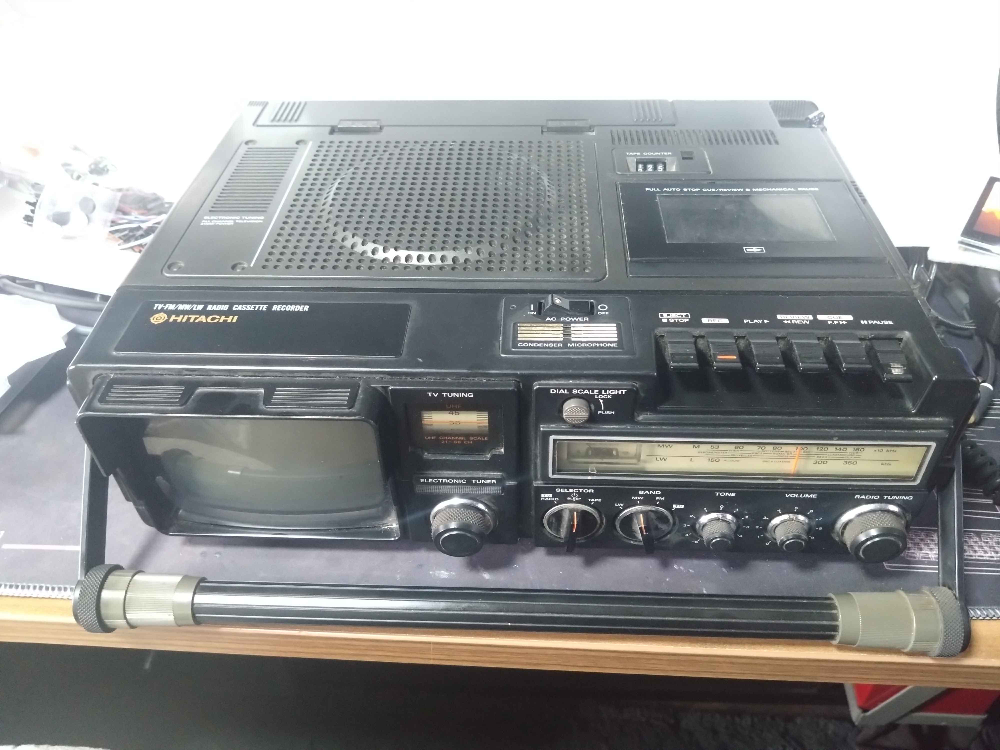
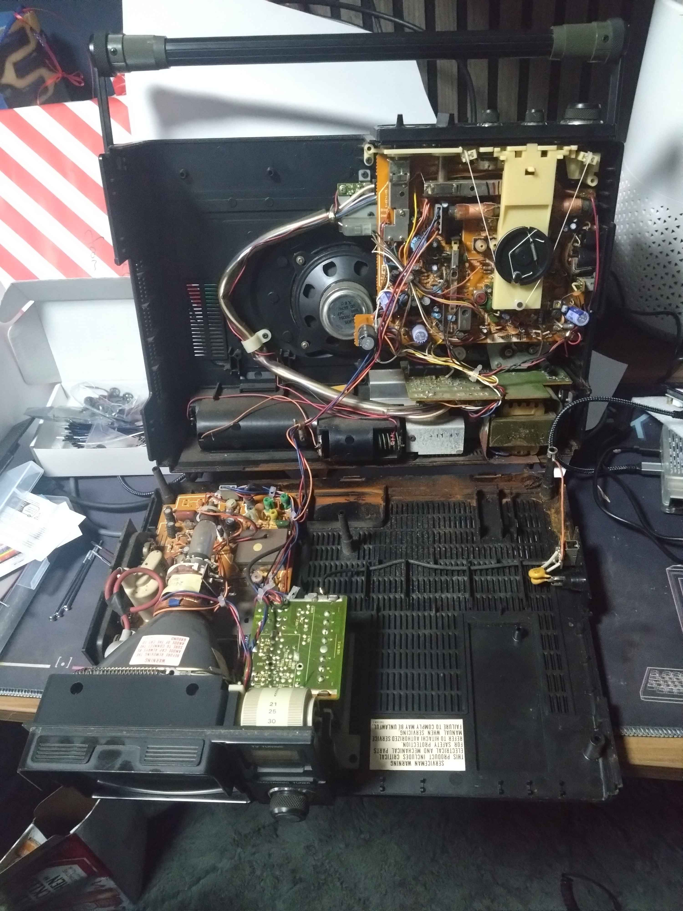
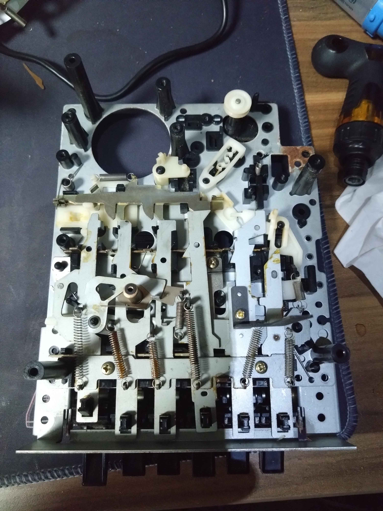
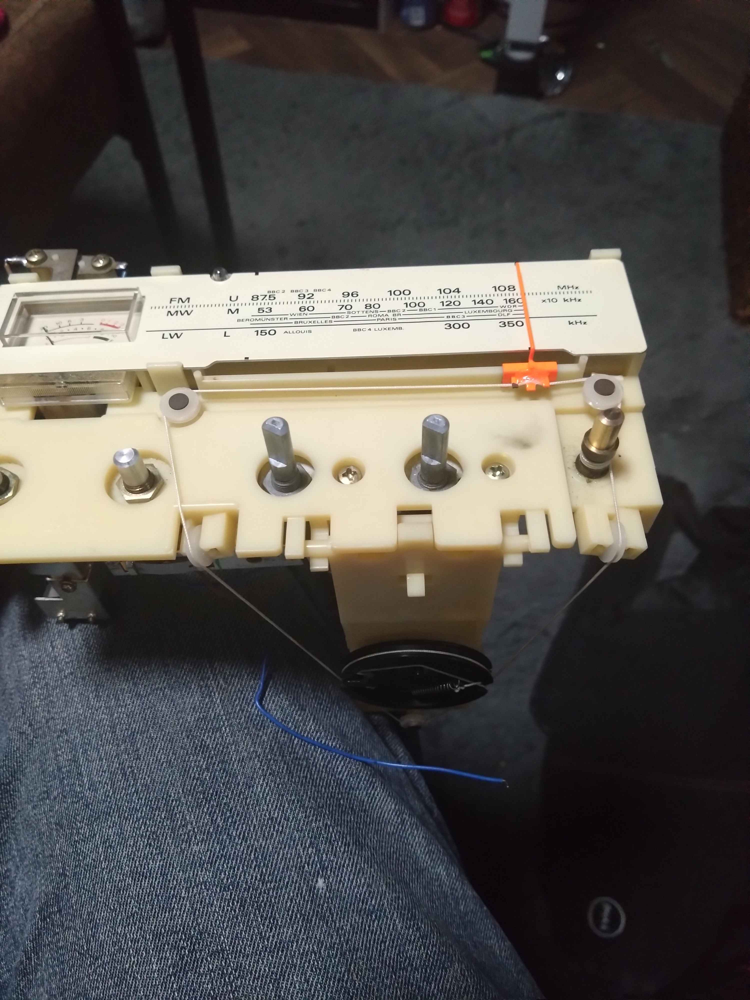
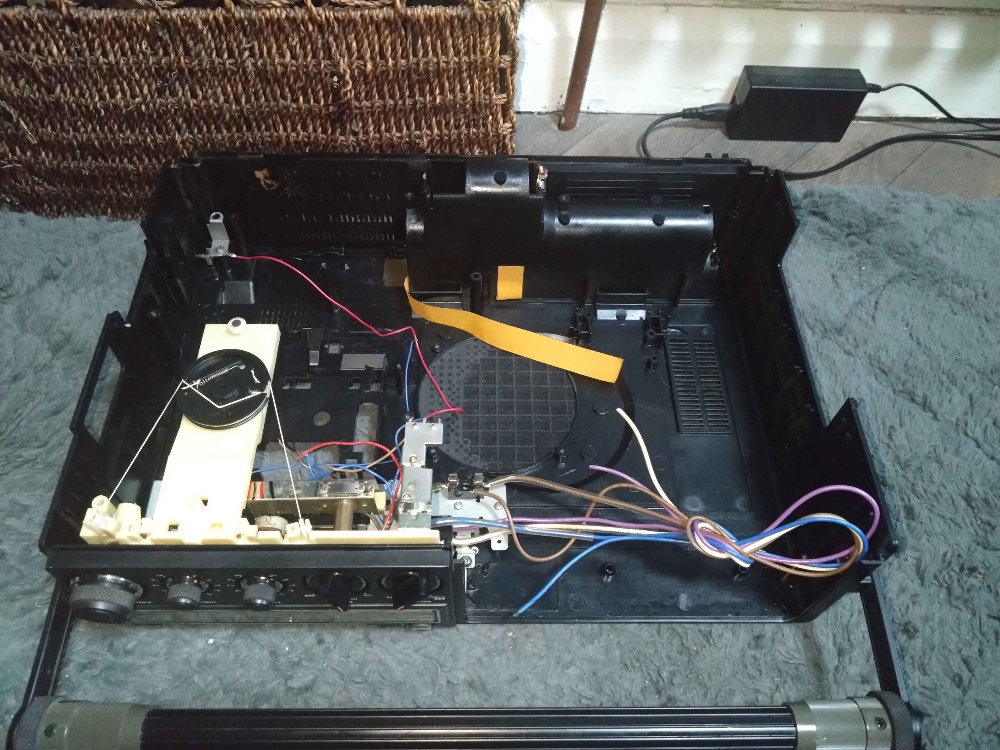
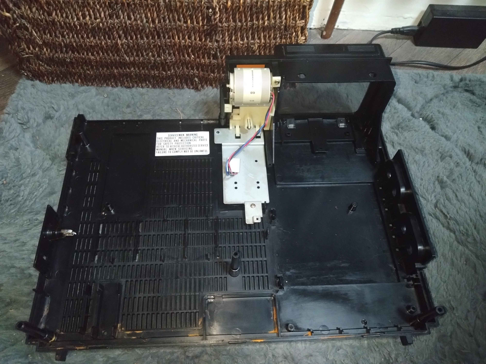

# The Ember Deck
A build log and ongoing experiment in turning an old radio into a Plexamp-powered media deck.

## About
Please note that these are not fullproof instructions, it’s a record of my trial and error that hopefully pays off, I aim to not put the things that don't work here and keep it clean and functional, though there may still be some unnecisary fluff that makes it's way in that isn't used, or some references that I forget to add in.

Things will vary between hardware used, I will not even try to pretend otherwise, but for all intent here is the hardware list:
- Pi 5
- USB DAC
- Dead TV Radio (please don’t gut working ones; have some decency)
- 4.5" Touchscreen

## Pi Software Setup

### Update the Pi and Packages
Keep it clean before you start piling new stuff on top. Saves a lot of time later.

```bash
sudo apt update && sudo apt full-upgrade -y
```
```bash
sudo reboot
```

### Add Bluetooth capability
#### Install Bluetooth speaker package
This lets the Pi talk to your phone.

```bash
sudo apt install -y bluez pulseaudio-module-bluetooth
```

#### Pair Phone to Pi and configure as trusted
If it refuses to connect, reboot and try again.

```bash
bluetoothctl
```
```bash
power on
agent on
scan on
pair <DEVICE_MAC>
trust <DEVICE_MAC>
connect <DEVICE_MAC>
exit
```

### Install plexamp headless
Nothing special, just setting up the player that’ll handle your music once everything else behaves.

#### Install the packages and configure
```bash
sudo apt install -y wget nodejs
```
```bash
wget -O plexamp.tar.bz2 https://plexamp.plex.tv/headless/Plexamp-Linux-headless-v<version>.tar.bz2
```
```bash
tar -xvf plexamp.tar.bz2
```
```bash
node plexamp/js/index.js
```

#### Create a plexamp headless service
```bash
mkdir -p ~/.config/systemd/user
nano ~/.config/systemd/user/plexamp.service
```

```ini
[Unit]
Description=Plexamp Headless
After=pipewire-pulse.service wireplumber.service network-online.target
Wants=pipewire-pulse.service wireplumber.service network-online.target

[Service]
Type=simple
WorkingDirectory=/home/<USERNAME>/plexamp
ExecStart=/usr/bin/node /home/<USERNAME>/plexamp/js/index.js --device pulse
Restart=on-failure
Environment=NODE_ENV=production

[Install]
WantedBy=default.target
```

```bash
systemctl --user daemon-reload
systemctl --user enable --now plexamp
```
```bash
sudo loginctl enable-linger <USERNAME>
```

### Embrace the lack of playback due to no valid output device
Half the work of using a DAC is convincing the Linux stack and Plex that it exists. The rest is pretending you understand why it stops working every other reboot.

#### Set default audio device to USB DAC
```bash
pactl list short sinks
```
Gives us -> alsa_output.usb-Audio_CODEC-00.analog-stereo
```bash
pactl set-default-sink alsa_output.usb-Audio_CODEC-00.analog-stereo
```
```bash
pactl info | grep "Default Sink"
```
```bash
wpctl status
```
Gives us -> 57
```bash
wpctl set-default 57
```

#### Create default configs because my plexamp client is a drama queen
To test if you need this ensure that you can use the following commands and play music through Plexamp.

```bash
pw-play /usr/share/sounds/alsa/Front_Center.wav
```
```bash
speaker-test -c2 -twav -D default
```

```bash
nano ~/.config/pulse/client.conf
```
```bash
default-sink = alsa_output.usb-Burr-Brown_from_TI_USB_Audio_CODEC-00.analog-stereo-output
```
```bash
sudo nano /etc/asound.conf
```
```ini                                                         
pcm.pulse {
    type pulse
}

ctl.pulse {
    type pulse
}

pcm.!default {
    type pulse
}

ctl.!default {
    type pulse
}
```



### Backup all your hard work (I will be saving it to my local plex media server)
You will break something. Back up now so you can restore it later without stressing as much.

#### Mount local plex server pc
```bash
sudo mkdir -p /mnt/plexserver
sudo mount -t cifs "//<SERVERIP>/<SERVERFOLDER>" /mnt/plexserver \
  -o username=<USERNAME>,password='<PASSWORD>',iocharset=utf8,file_mode=0777,dir_mode=0777,vers=3.0
```
  
#### Steam image to server
```bash
sudo dd if=/dev/mmcblk0 bs=4M status=progress | gzip -1 - > /mnt/plexserver/pi_backup_$(date +%F).img.gz
```

#### Unmount Server
```bash
sudo umount /mnt/plexserver
```

## Preparing the hardware
### Hardware disassembly
This is the part where you take something old apart and hope it forgives you, these will be about 40-50 years old, there will be things in here you dont want to breathe in and things that will disintergrate if you look at them too hard (looking at the rubber belts).



Do not poke, prod, or “see what happens” with the CRT circuitry (or any unfamiliar circuitry really). Those capacitors can hold several tens of thousands of volts, even when unplugged. If you don’t know how to discharge them safely, leave it alone. There’s no fun in finding out the hard way.

##### Take More Photos Than You Think You Need
Every circuit, every string based contraption, every weird bracket that only fits one way. Take a photo before you touch it. You’ll swear you’ll remember how it all went back together. You won’t.
I didn’t take enough pictures during teardown, and it made reassembly a guessing game that could’ve been avoided with two seconds of effort.

#### Open the case and have a look at what youre working with
The goal is to strip the donor unit down to what’s useful, cleanly and safely, without ruining your day with static discharge.



#### Start stripping the modular boards
Start by removing everything that’s not essential — old PCBs, speakers, knobs, tape decks, nostalgia. Desolder the components you plan to reuse, and get rid of the rest properly.
Important: dispose of all electronics according to your local waste and recycling rules. I’m not responsible for anyone who decides to treat “hazardous materials” as a suggestion.



#### Salvage the IO you can from these boards
If you’re keeping any of the original interface; knobs, dials, switches, sliders? take your time. They’re often the best part of these old units, and you won’t find replacements with the same feel anymore.

Potentiometers can be reused for volume or lighting control with a bit of rewiring. Switches and toggle mechanisms can be adapted to trigger GPIO inputs. Even the old string-driven tuning assemblies can stay in place for aesthetic or functional value; just make sure they move freely and don’t bind after reassembly (Yes it took me way too long to reassemble the ones on mine, I didnt take enough photos).

If you’re unsure what to keep, assume anything that clicks, turns, or resists you slightly might be worth saving.



##### When Things Break
Not everything will survive the desoldering process. Some parts are brittle from age, some were never meant to come off a board, and some just turn to dust the moment you touch them.
It’s normal. Don’t let it derail you. A broken potentiometer or cracked connector isn’t the end of the world — replacements are cheap and easy to find online (since actual local electronics shops seem to have gone the way of the CRT).

In my case, one potentiometer disintegrated mid-removal, and the multi-select switches looked like they required a PhD in mechanical sympathy just to reuse. I’ll be replacing them with modern equivalents that do the same job without the drama.
If something snaps, burns, or crumbles, just make a note and move on. The goal isn’t to preserve a relic; it’s to build something that works.

#### Clean up what you can
Once everything’s stripped, you’ll be left with what looks like the aftermath of an electrical fire in a scrapyard, it's time to clean it up.
I will be honest here, the first thing I did was take it outside and blast what I could off with a hosepipe. Then I let it dry off (please note that I didnt hose down the metal parts only the plastic case). After it was dry I used some WD40 contact cleaner, a rag, a nylon brush and some elbow grease to get *most* of the crap off the inside and out.
To finish, I gave the casing a quick blast of furniture polish for a bit of shine. It worked fine, but it doesn’t last long, proper plastic cleaner would’ve been smarter if I’d had any handy.





## Software
This is currently WIP
### LED Strip audio visualiser
#### Install prerequisits
```bash
sudo apt install libportaudio2 libportaudiocpp0 portaudio19-dev
```
```bash
pip install numpy sounddevice
```
```bash
python3 -m sounddevice
```
This should return a list of deivces