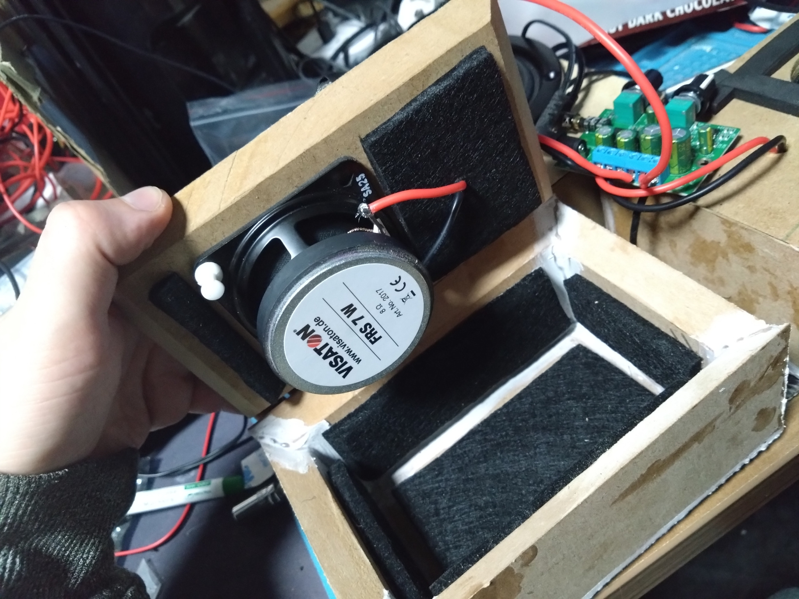
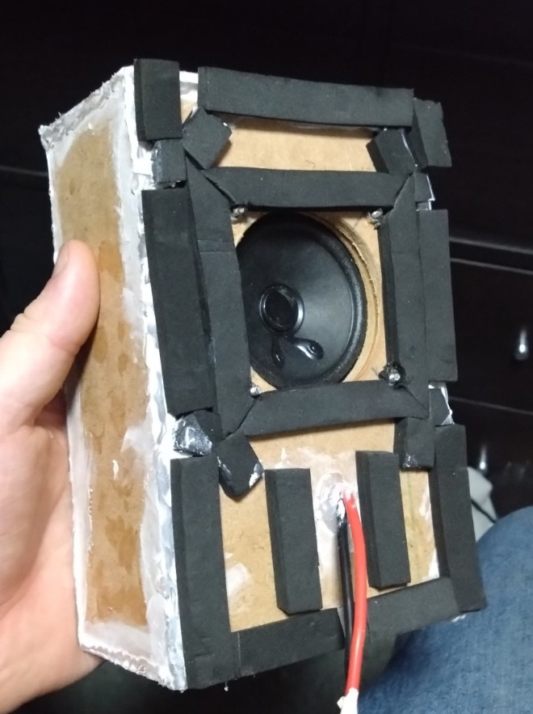

# The Ember Deck
A build log and ongoing experiment in turning an old radio into a Plexamp-powered media deck.

## About
Please note that these are not fullproof instructions, it’s a record of my trial and error that hopefully pays off, I aim to not put the things that don't work here and keep it clean and functional, though there may still be some unnecisary fluff that makes it's way in that isn't used, or some references that I forget to add in.

Things will vary between hardware used, I will not even try to pretend otherwise, but for all intent here is the hardware list:
- Pi 5
- USB DAC
- Dead TV Radio (please don’t gut working ones; have some decency)
- 4.3" Touchscreen
- 5.6" LCD
- 12v PSU
- 12v to 5v Buck Converters
- LED strip
- LED controller (I used a blinkstick)
- 2x Full Range Speakers
- 1x Subwoofer
- Class D AMP
- 2x fans (I don't think they are required but just incase)
- Fuses (I went full fusebox)
- Electronics (I will be all day listing the exact ones I got, enough for whatever I/O you need)
- Speaker boxes (I made mine myself out of MDF)

## Power & Wiring Plan

### Main power path
Mains (UK plug, 3A fuse)
→ 12 V DC PSU (<13A output)
→ Inline glass fuse (10A, positive only)  
→ Power switch (repurposed AC/DC selector, using AC terminals for my DC run)  
→ Main 12 V rail → fused distribution block

### Distribution Block Layout

| Port | Fuse | Wire | Load | Notes |
|:--|:--:|:--:|:--|:--|
| Main feed | 10 A | 14 AWG | PSU → Block |
| 1 | 5 A | 14 AWG | 12 V → 5 V PD Buck | Feeds Raspberry Pi 5 via USB-C |
| 2 | 3 A | 18 AWG | Powered USB Hub | Feeds screens / BlinkStick / DAC |
| 3 | 5 A | 14 AWG | Audio Amp | 37 W @ 12 V ≈ 3.4 A max |
| 4 | N/A | N/A | Spare | Optional future expansion |
| 5 | 1 A | 18 AWG | Fan 1 (via pot) | Intake |
| 6 | 1 A | 18 AWG | Fan 2 (via pot) | Exhaust |

### Grounding & Cabling

- **Ground:** all return to the distribution block negative; no daisy-chaining.  
- **Wire Gauge:**  
  - 14 AWG = main feed + high-load branches (amp, PD)  
  - 18 AWG = low-load branches (hub, fans, LEDs)
- **Fusing:** blade fuses (automotive ATO type) act as slow-blow; each branch fused individually.  
- **Connectors:** crimp or ferrule every stranded end; avoid bare wire under screws.  
- **Routing:** keep audio + LED wiring separate from high-current power lines.  
- **Power Switch light:** only connect to DC if rated; do *not* place directly on mains.  
- **Fans:** powered from 12 V through variable pots (speed control).  
- **USB Hub:** powered directly from 12 V rail; hub outputs handle 5 V devices.
- All DC wiring downstream of PSU only carries 12 V; mains insulation only needed up to PSU input.  

## I/O Map Checklist
Reference layout for controls, inputs, outputs, and hardware interfaces, documented for hardware assembly and software pin mapping.

### Inputs
#### Analog Inputs:
- [ ] name: radio tuner<br/>
      description: Sets color hue (static) or hue bias (dynamic)<br/>
      interface: ADC<br/>
      channel: CH0<br/>
      notes: 0–360° hue map in static mode; ±60° bias in dynamic

- [ ] name: tv tuner<br/>
      description: Sets color saturation/value (static) or contrast bias (dynamic)<br/>
      interface: ADC<br/>
      channel: CH1<br/>
      notes: Smooth nonlinear response (use smoothstep mapping)

- [ ] name: screen brightness potentiometer<br/>
      description: Controls LCD backlight brightness<br/>
      interface: ADC<br/>
      channel: CH2<br/>
      notes:

- [ ] name: visualiser gain potentiometer<br/>
      description: Scales FFT amplitude for LED visualiser<br/>
      interface: ADC<br/>
      channel: CH3<br/>
      notes:
#### Digital Inputs:
- [ ] name: 3-way selector<br/>
      description: TV / Neutral / Radio LED mode<br/>
      pins: <br/>
      notes: Binary encoded (00/01/10); used to select what the 4 way selector affects

- [ ] name: 4-way selector<br/>
      description: Visualiser mode selector<br/>
      pins: <br/>
      notes: Binary encoded (00/01/10/11) for four visualiser modes

- [ ] name: tape buttons<br/>
      description: Media control buttons repurposed from tape deck + Safe shutdown trigger<br/>
      mapping:<br/>
			- play:    Play/Pause toggle<br/>
			- pause:   Stop playback<br/>
			- ff:      Next track<br/>
			- rew:     Previous track<br/>
			- eject:   Pi Power button<br/>
			- record:  Toggle color mode (Static / Dynamic)<br/>
      pins:<br/>
      notes: Software debounced

### Outputs

#### Stepper Outputs:
- [ ] name: deck timer<br/>
      description: Drives 3-digit analog timer (cosmetic)<br/>
      driver:<br/>
      pins:<br/>
      notes: Not time-accurate

#### Analog Outputs:
- [x] name: vu meter<br/>
      description: Retro “battery” needle repurposed as hardware VU<br/>
      driver: <br/>
      input source: Summed L+R audio line<br/>
      notes: No Pi involvement; purely analog swing via op-amp rectifier
	  

### Hardware Only:
- [x] name: fan speed 1<br/>
      description: Analog potentiometer directly controls input fan driver circuit
	  
- [x] name: fan speed 2<br/>
      description: Analog potentiometer directly controls output fan driver circuit
	  
- [ ] name: volume<br/>
      description: Potentiometer wired to amplifier board (hardware volume)
	  
- [ ] name: tone<br/>
      description: Potentiometer wired to amplifier board (bass boost)

### USB Peripherals:
- [ ] name: led strip controller<br/>
      description: USB-addressable LED strip (BlinkStick Pro)<br/>
      connection: USB-A<br/>
      notes: Controlled via Python HID or blinkstick library for real-time audio visualisation output

- [x] name: touchscreen display<br/>
      description: 4.3" USB-C touchscreen for media control interface<br/>
      connection: USB-A<br/>
      notes: No GPIO used

- [x] name: DAC<br/>
      description: USB DAC for better audio quality<br/>
      connection: USB-A<br/>
      notes: Used for audio output to AMP and monitor connection

- [ ] name: powered usb hub<br/>
      description: 12V input → 5V regulated hub supplying peripherals<br/>
      notes: Provides stable current for LED strip, screens, and controllers

## Pi Software Setup

### Update the Pi and Packages
Keep it clean before you start piling new stuff on top. Saves a lot of time later.

```bash
sudo apt update && sudo apt full-upgrade -y
```
```bash
sudo reboot
```

### Add Bluetooth capability
#### Install Bluetooth speaker package
This lets the Pi talk to your phone.

```bash
sudo apt install -y bluez pulseaudio-module-bluetooth
```

#### Pair Phone to Pi and configure as trusted
If it refuses to connect, reboot and try again.

```bash
bluetoothctl
```
```bash
power on
agent on
scan on
pair <DEVICE_MAC>
trust <DEVICE_MAC>
connect <DEVICE_MAC>
exit
```

### Install plexamp headless
Nothing special, just setting up the player that’ll handle your music once everything else behaves.

#### Install the packages and configure
```bash
sudo apt install -y wget nodejs
```
```bash
wget -O plexamp.tar.bz2 https://plexamp.plex.tv/headless/Plexamp-Linux-headless-v<version>.tar.bz2
```
```bash
tar -xvf plexamp.tar.bz2
```
```bash
node plexamp/js/index.js
```
##### If you have issues use NVM to install NodeJS
```bash
curl -o- https://raw.githubusercontent.com/nvm-sh/nvm/v0.39.7/install.sh | bash
source ~/.bashrc  # or source ~/.zshrc if using zsh
```
```bash
nvm install stable
nvm use stable
```
#### Create a plexamp headless service
```bash
mkdir -p ~/.config/systemd/user
nano ~/.config/systemd/user/plexamp.service
```

```ini
[Unit]
Description=Plexamp Headless
After=pipewire-pulse.service wireplumber.service network-online.target
Wants=pipewire-pulse.service wireplumber.service network-online.target

[Service]
Type=simple
WorkingDirectory=/home/<USERNAME>/plexamp
ExecStart=/usr/bin/node /home/<USERNAME>/plexamp/js/index.js --device pulse
Restart=on-failure
Environment=NODE_ENV=production

[Install]
WantedBy=default.target
```

```bash
systemctl --user daemon-reload
systemctl --user enable --now plexamp
```
```bash
sudo loginctl enable-linger <USERNAME>
```

### Embrace the lack of playback due to no valid output device
Half the work of using a DAC is convincing the Linux stack and Plex that it exists. The rest is pretending you understand why it stops working every other reboot.

#### Set default audio device to USB DAC
```bash
pactl list short sinks
```
Gives us -> alsa_output.usb-Audio_CODEC-00.analog-stereo
```bash
pactl set-default-sink alsa_output.usb-Audio_CODEC-00.analog-stereo
```
```bash
pactl info | grep "Default Sink"
```
```bash
wpctl status
```
Gives us -> 57
```bash
wpctl set-default 57
```

#### Create default configs because my plexamp client is a drama queen
To test if you need this ensure that you can use the following commands and play music through Plexamp.

```bash
pw-play /usr/share/sounds/alsa/Front_Center.wav
```
```bash
speaker-test -c2 -twav -D default
```

```bash
nano ~/.config/pulse/client.conf
```
```bash
default-sink = alsa_output.usb-Burr-Brown_from_TI_USB_Audio_CODEC-00.analog-stereo-output
```
```bash
sudo nano /etc/asound.conf
```
```ini                                                         
pcm.pulse {
    type pulse
}

ctl.pulse {
    type pulse
}

pcm.!default {
    type pulse
}

ctl.!default {
    type pulse
}
```


### Backup all your hard work (I will be saving it to my local plex media server)
You will break something. Back up now so you can restore it later without stressing as much.

#### Mount local plex server pc
```bash
sudo mkdir -p /mnt/plexserver
sudo mount -t cifs "//<SERVERIP>/<SERVERFOLDER>" /mnt/plexserver \
  -o username=<USERNAME>,password='<PASSWORD>',iocharset=utf8,file_mode=0777,dir_mode=0777,vers=3.0
```
  
#### Steam image to server
```bash
sudo dd if=/dev/mmcblk0 bs=4M status=progress | gzip -1 - > /mnt/plexserver/pi_backup_$(date +%F).img.gz
```

#### Unmount Server
```bash
sudo umount /mnt/plexserver
```

## Preparing the hardware
### Hardware disassembly
This is the part where you take something old apart and hope it forgives you, these will be about 40-50 years old, there will be things in here you dont want to breathe in and things that will disintergrate if you look at them too hard (looking at the rubber belts).


Do not poke, prod, or “see what happens” with the CRT circuitry (or any unfamiliar circuitry really). Those capacitors can hold several tens of thousands of volts, even when unplugged. If you don’t know how to discharge them safely, leave it alone. There’s no fun in finding out the hard way.

##### Take More Photos Than You Think You Need
Every circuit, every string based contraption, every weird bracket that only fits one way. Take a photo before you touch it. You’ll swear you’ll remember how it all went back together. You won’t.
I didn’t take enough pictures during teardown, and it made reassembly a guessing game that could’ve been avoided with two seconds of effort.

#### Open the case and have a look at what youre working with
The goal is to strip the donor unit down to what’s useful, cleanly and safely, without ruining your day with static discharge.


#### Start stripping the modular boards
Start by removing everything that’s not essential — old PCBs, speakers, knobs, tape decks, nostalgia. Desolder the components you plan to reuse, and get rid of the rest properly.
Important: dispose of all electronics according to your local waste and recycling rules. I’m not responsible for anyone who decides to treat “hazardous materials” as a suggestion.


#### Salvage the IO you can from these boards
If you’re keeping any of the original interface; knobs, dials, switches, sliders? take your time. They’re often the best part of these old units, and you won’t find replacements with the same feel anymore.

Potentiometers can be reused for volume or lighting control with a bit of rewiring. Switches and toggle mechanisms can be adapted to trigger GPIO inputs. Even the old string-driven tuning assemblies can stay in place for aesthetic or functional value; just make sure they move freely and don’t bind after reassembly (Yes it took me way too long to reassemble the ones on mine, I didnt take enough photos).

If you’re unsure what to keep, assume anything that clicks, turns, or resists you slightly might be worth saving.


##### When Things Break
Not everything will survive the desoldering process. Some parts are brittle from age, some were never meant to come off a board, and some just turn to dust the moment you touch them.
It’s normal. Don’t let it derail you. A broken potentiometer or cracked connector isn’t the end of the world — replacements are cheap and easy to find online (since actual local electronics shops seem to have gone the way of the CRT).

In my case, one potentiometer disintegrated mid-removal, and the multi-select switches looked like they required a PhD in mechanical sympathy just to reuse. I’ll be replacing them with modern equivalents that do the same job without the drama.
If something snaps, burns, or crumbles, just make a note and move on. The goal isn’t to preserve a relic; it’s to build something that works.

#### Clean up what you can
Once everything’s stripped, you’ll be left with what looks like the aftermath of an electrical fire in a scrapyard, it's time to clean it up.
I will be honest here, the first thing I did was take it outside and blast what I could off with a hosepipe. Then I let it dry off (please note that I didnt hose down the metal parts only the plastic case). After it was dry I used some WD40 contact cleaner, a rag, a nylon brush and some elbow grease to get *most* of the crap off the inside and out.
I then took out my oscillating saw and started cutting out what I didn't need from the inside to make room for my electronics and the overspec'd subwoofer enclosure.
To finish, I gave the casing a quick blast of furniture polish for a bit of shine. It worked fine, but it doesn’t last long, proper plastic cleaner would’ve been smarter if I’d had any handy.


### Building The Speakers
You do not have to build your own speakers, there are plenty of good enough self contained TV/Soundbar speakers you can buy off the shelf to use, I merely wanted to go overboard.

I started with a speaker to match the one I removed, the 4" speaker that has a 4.5" external grill... Thanks Hitachi. I decided since it was a mono setup and this speaker was in the middle I would make this a large subwoofer. To pair with this I bought two 3" full range drivers for left and right channels.
I will not claim I am an audio expert, but I did some basic research on this and went with a, better than buy a cheap chinese speaker, goal. I also went with 8ohm rather than 4ohm because they will be loud enough and I don't care too much about obsessivly loud music anyway.

For the case, we are after a fully sealed case with about 9mm of MDF for full sound absorbtion so it wont interfere with the other speakers, though this is less redundant now they are not crammed inside the case together. I went with 12mm MDF for the subwoofer. As for box size, I went with not quite but close enough to the golden ratio for depth, width and height, and also filled the inside with some acoustic foam and slightly offset the speaker position, all of this was to reduce/eliminate sound wave stuff (professional term I swear). I then routed the cabled outside of the boxes, and glued them together with PVA, as my cuts were not perfect, im not a woodworker, I filled in the big gaps with hot glue, and then sealed everything with decorators caulk. It looks a complete mess but the difference between sealed and unsealed was night and day. I then put some foam around the top to help dampen it and seal it so the sound goes out of the case not inside it.


### Getting everything running off of AC
At this stage, the goal is not elegance or cable management, its more so we dont have 15 plug sockets to run the decks components. It is also to get the entire system running safely and predictably from mains power, and to lock down the physical layout before committing to anything permanent.

As a token disclaimer, I am not an electrition or even an electrical engineer, do not mess around with AC or even DC if you do not know what you are doing. I am not responsible for you doing something dumb.

#### The Speakers
Before touching power, install the speaker(s).

Speaker volume, enclosure shape, and clearance dictate more of the internal layout than any other component. You also should concider the acoustics, otherwise you are basically shooting yourself in the foot for no reason. In this build there wasn’t sufficient internal volume for a full 2.1 setup, so the compromise was:
- Internal: a single subwoofer mounted in-case
- External: two bookshelf speakers for left and right channels

This decision frees internal space, simplifies airflow and cable routing, and avoids trying to force acoustics to behave in a box that was only designed for radio quality mono.

At this stage, the subwoofer does not need to be permanently mounted, but it does need to be positioned realistically, I placed mine where the old speaker was so that it is pre grilled.
You should know:
- Where it sits
- How much volume it occupies
- Where cables will exit
- What it blocks
- Everything else works around this.

#### Installing the AC Inlet
Once the speaker location is defined, you can establish the Main Power Path.
Start by cutting and installing an AC power inlet on the case. A panel-mount inlet with an integrated fuse is strongly recommended.
This gives you:
- A clean external power connection
- Basic overcurrent protection at the entry point
- A defined and serviceable mains boundary

Mount the inlet securely. This is not a “temporary” part, even if other components are still movable.

#### AC to 12 V PSU
From the AC inlet:
- Run live, neutral and earth directly to the 12 V power supply unit
- Earth the chassis appropriately if required, depending on the PSU design and enclosure material
- Try keep the AC cables out of the way and pretend they no longer exist

The 12 V PSU becomes the backbone of the entire system. Nothing downstream should ever see mains voltage.

At this stage:
- Do not permanently shorten cables
- Do not glue or lock anything down
- Ensure strain relief and insulation are correct
You’re proving the concept, not finishing it.

#### 12 V Distribution and Fuse Box

From the PSU output Route 12 V into a DC fuse box. Each major subsystem should have its own fused output, this establishes a cleaner, logical power grid:
- One input
- Multiple protected branches
- Easy fault isolation later

Even if not all loads are connected yet, the fuse box should be installed and wired as if they will be, at this stage we can now attach/remove our components to/from the fuse box for easier testing.

## Software
This is currently WIP
### LED Strip audio visualiser
#### Create python Environment
Create a folder for your python environment, I created a folder called `EmberDeck` in my home dir. Once this is done turn it into a python environment.
```bash
cd ~/EmberDeck
python3 -m venv .venv
source .venv/bin/activate
```
#### Install prerequisits
```bash
sudo apt install libportaudio2 libportaudiocpp0 portaudio19-dev
```
when using python you will need to make sure you use the correct source, you will need to use the following commands
```bash
cd ~/EmberDeck
python3 -m venv --system-site-packages .venv
source .venv/bin/activate
```
you can then install the prerequisits to this environment
```bash
pip install numpy sounddevice pyyaml plexapi blinkstick pyusb adafruit-circuitpython-ads1x15 board adafruit-blinka gpiozero
```
```bash
python3 -m sounddevice
```
This should return a list of deivces

#### Install BlinkStick
We should already have pip installed these into our local environment, so now we just need to get blinkstick working, firstly we need to get usb access.
```bash
sudo nano /etc/udev/rules.d/99-blinkstick.rules
```
Paste in
```bash
SUBSYSTEM=="usb",    ATTR{idVendor}=="20a0", ATTR{idProduct}=="41e5", MODE="0666"
SUBSYSTEM=="hidraw", KERNEL=="hidraw*", ATTRS{idVendor}=="20a0", ATTRS{idProduct}=="41e5", MODE="0666"
```
Then restart the usb rules
```bash
sudo udevadm control --reload-rules
sudo udevadm trigger
```
try running the following command to test that it is working
```bash
cd ~/EmberDeck
source .venv/bin/activate

blinkstick --info
```
Now I had an error with file not found here, its okay for some reason the pip package I got was not set as an executable, try This
```bash
chmod +x .venv/bin/blinkstick
```
then try again, if you're as unlucky as me you get an error `env: ‘python\r’: No such file or directory`
```bash
dos2unix .venv/bin/blinkstick
```
Go to `.venv/lib/python3.*/site-packages/blinkstick/blinkstick.py` and replace `from collections import Callable` with `from collections.abc import Callable`

#### WIP